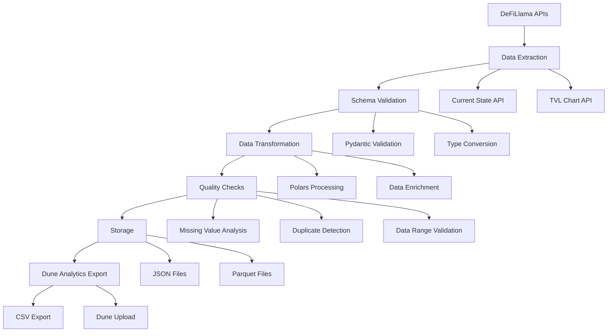

# DeFiLlama Data Pipeline to Dune

A pipeline that extracts Pool TVL and APY data from DeFiLlama APIs and prepares it for Dune consumption.

## Architecture Overview

- **Functional Pipeline**: Method chaining for composable data transformations
- **Modular Design**: Separation of concerns with clear boundaries
- **Schema-First**: Pydantic validation and Polars schemas
- **Reliability**: Exponential backoff, retry logic, and idempotent operations
- **Performance**: Polars for fast data processing, DuckDB for analytics
- **Data Quality**: Comprehensive validation and quality checks
- **Observability**: Detailed logging and error handling

## Project Structure

```
pipe-defillama-data-to-dune/
├── src/                          # Core application logic
│   ├── coreutils/                 # Shared utilities
│   │   ├── request.py              # HTTP client with retry logic
│   │   ├── data.py                 # Data conversion utilities
│   │   ├── env.py                  # Environment management
│   │   └── time.py                 # Time utilities
│   └── datasources/              # Data source implementations
│       └── defillama/
│           └── yieldpools/
│               ├── schemas.py         # Pydantic & Polars schemas
│               ├── current_state.py   # Current state data handler (primary)
│               ├── historical_tvl.py  # Historical TVL data handler (primary)
│               └── metadata.py        # Legacy metadata handler (deprecated)
├── scripts/                        
│   ├── fetch_current_state.py                 # Fetch current pool state (PRIMARY)
│   ├── fetch_tvl.py                           # Fetch historical TVL data (PRIMARY)
│   ├── export_current_state_for_dune.py       # Export current state for Dune (PRIMARY)
│   ├── export_tvl_for_dune.py                 # Export TVL data for Dune (PRIMARY)
│   ├── fetch_yields.py                        # Fetch yield pool metadata (legacy)
│   ├── convert_tvl_to_parquet.py              # Convert JSON to Parquet (utility)
│   └── join_and_enrich_data.py                # Data joining and enrichment (utility)
├── notebooks/                    
│   └── defillama_data_quality_checks.ipynb
├── output/                          # Generated data files (gitignored)
│   ├── tvl_data.json                          # Historical TVL data
│   ├── tvl_data.parquet                       # Compressed TVL data
│   ├── current_state.json                     # Current pool states
│   ├── current_state.parquet                  # Compressed current state
│   ├── tvl_data_for_dune.csv                  # Dune-optimized TVL export
│   └── current_state_for_dune.csv             # Dune-optimized current state
├── docs/                        
│   └── dune_upload_guide.md         # Dune Analytics integration guide
└── requirements.txt                           # Python dependencies
```

## Primary Operations

This pipeline focuses on two main data flows:

### 1. **Current State Data** (Dimension Table)
- **File**: `src/datasources/defillama/yieldpools/current_state.py`
- **Class**: `YieldPoolsCurrentState`
- **Script**: `scripts/fetch_current_state.py`
- **Purpose**: Fetches current pool metadata, TVL, and APY data
- **Output**: `output/current_state_YYYY-MM-DD.parquet`

### 2. **Historical TVL Data** (Fact Table)
- **File**: `src/datasources/defillama/yieldpools/historical_tvl.py`
- **Class**: `YieldPoolsTVLFact`
- **Script**: `scripts/fetch_tvl.py`
- **Purpose**: Fetches historical time-series TVL and APY data
- **Output**: `output/tvl_data_YYYY-MM-DD.parquet`

### 3. **Dune Analytics Export**
- **Scripts**: `export_current_state_for_dune.py`, `export_tvl_for_dune.py`
- **Purpose**: Transform and export data for Dune Analytics consumption
- **Output**: `output/*_for_dune.csv`

## Quick Start

### Prerequisites

- Python 3.10+
- Virtual environment (recommended)

### Installation

```bash
# Clone the repository
git clone https://github.com/PaulApivat/pipe-defillama-data-to-dune.git
cd pipe-defillama-data-to-dune

# Create and activate virtual environment
python -m venv .venv
source .venv/bin/activate  # On Windows: .venv\Scripts\activate

# Install dependencies
pip install -r requirements.txt
```

### Basic Usage

```bash
# 1. Fetch current pool state data (PRIMARY)
python -m scripts.fetch_current_state

# 2. Fetch historical TVL data (PRIMARY)
python -m scripts.fetch_tvl

# 3. Export data for Dune Analytics (PRIMARY)
python -m scripts.export_current_state_for_dune
python -m scripts.export_tvl_for_dune

# 4. Explore data quality
jupyter notebook notebooks/defillama_data_quality_checks.ipynb
```

### Functional Pipeline Example

The pipeline uses method chaining for composable data transformations:

```python
# Current State Pipeline
current_state = (
    YieldPoolsCurrentState.fetch()
    .filter_by_projects(TARGET_PROJECTS)
    .transform_pool_old()
    .validate_schema(CURRENT_STATE_SCHEMA)
    .sort_by_tvl(descending=True)
)

# Historical TVL Pipeline
tvl_data = (
    YieldPoolsTVLFact.fetch_incremental_tvl(metadata_source=metadata)
    .validate_schema()
    .sort_by_timestamp(descending=False)
)
```

## Data Model

### Star Schema Design

**Fact Table: `tvl_data`**
- Historical TVL and APY data over time
- Primary key: `(pool_id, timestamp)`
- Measures: `tvl_usd`, `apy`, `apy_base`, `apy_reward`

**Dimension Table: `current_state`**
- Current pool metadata and state
- Primary key: `pool`
- Attributes: `protocol_slug`, `chain`, `symbol`, `pool_old`, etc.

### Data Dictionary

#### TVL Data (Fact Table) - `HISTORICAL_TVL_SCHEMA`
| Column | Type | Description |
|--------|------|-------------|
| `timestamp` | STRING | Data point timestamp (ISO 8601) |
| `tvl_usd` | FLOAT64 | Total Value Locked in USD |
| `apy` | FLOAT64 | Annual Percentage Yield |
| `apy_base` | FLOAT64 | Base APY (without rewards) |
| `apy_reward` | FLOAT64 | Reward APY component |
| `pool_id` | STRING | Unique pool identifier |

#### Current State (Dimension Table) - `CURRENT_STATE_SCHEMA`
| Column | Type | Description |
|--------|------|-------------|
| `pool` | STRING | Pool identifier (join key) |
| `protocol_slug` | STRING | Protocol name (e.g., 'curve-dex') |
| `chain` | STRING | Blockchain network |
| `symbol` | STRING | Pool symbol (e.g., 'WETH-USDC') |
| `underlying_tokens` | LIST[STRING] | List of underlying token addresses |
| `reward_tokens` | LIST[STRING] | List of reward token addresses |
| `timestamp` | STRING | ISO 8601 timestamp of current state |
| `tvl_usd` | FLOAT64 | Current Total Value Locked in USD |
| `apy` | FLOAT64 | Current Annual Percentage Yield |
| `apy_base` | FLOAT64 | Current Base APY (without rewards) |
| `apy_reward` | FLOAT64 | Current Reward APY |
| `pool_old` | STRING | Legacy pool identifier |

## Key Features

### 1. **Reliability & Resilience**
- **Exponential Backoff**: Automatic retry with increasing delays
- **Rate Limiting**: Respects API rate limits
- **Idempotent Operations**: Safe to re-run without side effects
- **Error Handling**: Comprehensive exception handling and logging

### 2. **Data Quality & Validation**
- **Schema Validation**: Pydantic models ensure data integrity
- **Type Safety**: Strong typing throughout the pipeline
- **Data Quality Checks**: Comprehensive validation in Jupyter notebooks
- **Null Handling**: Proper handling of missing values

### 3. **Performance & Scalability**
- **Polars**: Fast DataFrame operations for large datasets
- **DuckDB**: In-memory analytics for data exploration
- **Parquet**: Columnar storage for efficient compression
- **Lazy Evaluation**: Optimized query execution

### 4. **Functional Programming & Data Engineering Best Practices**
- **Method Chaining**: Composable data transformations with `.pipe()` operations
- **Immutable Operations**: Each transformation returns a new instance
- **Pure Functions**: Predictable, testable data processing functions
- **Separation of Concerns**: Clear module boundaries
- **DRY Principle**: Reusable utilities and functions
- **Configuration Management**: Environment-based settings
- **Version Control**: Proper .gitignore and clean commits

## Data Pipeline Flow



## Development

### Adding New Data Sources

1. Create new module in `src/datasources/`
2. Define Pydantic schemas in `schemas.py`
3. Implement data fetching logic
4. Add data quality checks
5. Create export scripts for target systems

### Running Tests

```bash
# Run data quality checks
jupyter notebook notebooks/defillama_data_quality_checks.ipynb

# Test individual components
python -m scripts.fetch_current_state
python -m scripts.export_tvl_for_dune
```

### Data Exploration

```python
import duckdb
import polars as pl

# Connect to DuckDB
conn = duckdb.connect(":memory:")

# Query TVL data
tvl_data = conn.execute("""
    SELECT 
        pool_id,
        timestamp,
        tvlUsd,
        apy
    FROM read_parquet('output/tvl_data.parquet')
    WHERE pool_id = 'your-pool-id'
    ORDER BY timestamp
""").fetchdf()

# Query current state
current_state = conn.execute("""
    SELECT 
        pool,
        protocol_slug,
        chain,
        symbol,
        tvl_usd,
        apy
    FROM read_parquet('output/current_state.parquet')
    WHERE protocol_slug = 'curve-dex'
""").fetchdf()
```

## Configuration

### Environment Variables

Create a `.env` file in the project root:

```env
# DeFiLlama API Configuration
DEFILLAMA_API_KEY=your_api_key_here
DEFILLAMA_BASE_URL=https://yields.llama.fi

# Dune Analytics Configuration
DUNE_API_KEY=your_dune_api_key
DUNE_QUERY_ID=your_query_id

# Data Processing Configuration
BATCH_SIZE=1000
RATE_LIMIT_DELAY=0.1
MAX_RETRIES=5
```

## Monitoring & Observability

### Logging
- Request timing and success rates
- Data quality metrics
- Error tracking and alerting
- Performance monitoring

### Data Quality Metrics
- Record counts and completeness
- Data freshness and staleness
- Schema validation success rates
- Duplicate detection results

## Future Enhancements

### Immediate (Next Sprint)
- [ ] Unit test suite with pytest
- [ ] CI/CD pipeline with GitHub Actions
- [ ] Data quality dashboard
- [ ] Automated alerting system

### Medium Term
- [ ] Real-time streaming pipeline
- [ ] Data lineage tracking
- [ ] Advanced anomaly detection
- [ ] Multi-source data integration

### Long Term
- [ ] Machine learning pipeline
- [ ] Advanced analytics and forecasting
- [ ] Multi-cloud deployment
- [ ] Data governance framework

## Contributing

1. Fork the repository
2. Create a feature branch
3. Make your changes
4. Add tests if applicable
5. Submit a pull request

## License

This project is licensed under the MIT License - see the [LICENSE](LICENSE) file for details.

## Acknowledgments

- DeFiLlama for providing comprehensive DeFi data APIs
- Dune for powerful blockchain analytics platform
- Polars team for fast DataFrame library
- DuckDB team for embedded analytical database

---

